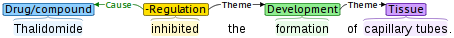

# biomedical-argument-extraction
生物医学事件要素(argument)识别

## 项目介绍
I will give a description of this project after the paper is published.

## 事件要素的定义
一个事件由一个触发词和若干个要素构成。

触发词的类型反映了事件的类型，通常为动词或者动名词。而事件的要素指的是事件的参与者，  
通常为句子中的实体或者另一个事件。

如下图所示，该示例中包含两个事件：  
第一个事件为Development事件（表示为E1），包含一个触发词“formation”和其对应的Theme类型的要素“capillary tubes”；  
第二个事件为Negative Regulation事件（表示为E2），包含一个触发词“inhibited”，一个Cause类型要素“Thalidomide”和一个Theme类型要素E1。  

两个事件的结构化表示为：  
Event E1 (Type: Development, Trigger: formation, Theme: capillary tubes);  
Event E2 (Type: Negative_regulation, Trigger: inhibited, Theme: Event E1, Cause: Thalidomide)。  
其中事件E2为嵌套事件，因为它的Theme要素同样为一个事件。



一般来说，识别要素的时候，需要将事件的参与者与所在事件的触发词对应起来。  
本项目中，将对应后的触发词和事件参与者称作要素。

## 模型介绍
- relation_attention:         attention + type clues
- relation_attention_b:       attention
- relation_baseline:          sentence clues + type clues (inputs contain entity information)
- relation_baseline_b:        sentence clues + type clues
- relation_baseline_c:        sentence clues + type clues (inputs only contain word embeddings)
- relation_interaction:       a mysterious model
- relation_mask:              trigger + argument + type clues
- relation_mask_attention:    attention + trigger + argument + type clues
- relation_mask_b:            trigger + argument
- relation_mask_c:            trigger + argument (no position embeddings)
- relation_pure_attention:    attention
- relation_pure_baseline:     sentence
- relation_fusion:            a mysterious model
- relation_fusion_b:          a mysterious model
- ta_ty_attention:            同时使用语义信息和类型组合信息的多注意力机制

## 运行方法
原谅我的习惯，这次依然没有提供一键运行流程，但是运行依然很简单，
先运行DataIntegration.py生成数据即可，接下来可以运行任意一个模型文件。


## 关于
```
未来数据研究所.LiuYang
```
